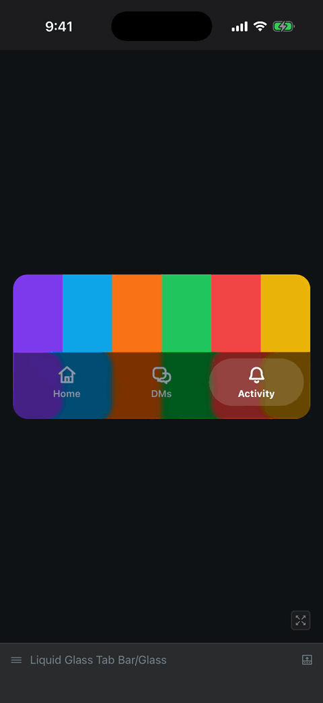

# React Native Liquid Glass Tab Bar

An Expo + Storybook example of a draggable tab bar indicator inspired by iOS Liquid Glass.

## Demo



[Watch the MP4 demo](assets/demo.mp4).

The example includes:

- native `expo-glass-effect` rendering on iOS 26+;
- a surface fallback using `expo-blur`;
- direct drag interaction with `react-native-gesture-handler`;
- long-press anywhere on the bar to pull the indicator to the finger;
- distance-based width, height, and corner-radius motion;
- clipped active icon and label highlighting;
- Storybook stories for 4-item, 5-item, surface, glass, and side-by-side demos.

## Run

```sh
pnpm install
pnpm ios
```

For a quick type check:

```sh
pnpm typecheck
```

The implementation trail, including the native glass issues found while tuning
the tab bar, is in [ARTICLE.md](ARTICLE.md).
